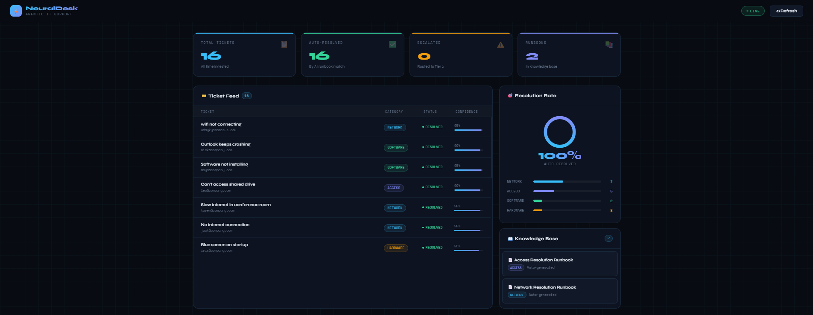

# Agentic IT Support Automation System

An end-to-end agentic workflow that ingests enterprise support tickets, classifies intent using an LLM, matches against a runbook knowledge base, and either auto-resolves or routes to the correct Tier 2 engineer

## Dashboard




## Architecture
Ticket Intake (Flask API)
↓
LLM Intent Classifier (GPT-4o-mini)
↓
Confidence Router (threshold: 0.75)
↙          ↘
Auto-Resolve    Escalate to Tier 2
(ChromaDB KB)   (with full context)
↘          ↙
Runbook Generator
(pattern analysis → drafts guides)
↓
SQLite Log + ChromaDB KB

## Features

- **Ticket Ingestion** — Flask REST API accepts tickets in JSON format with validation and deduplication
- **LLM Classification** — GPT-4o-mini classifies each ticket into category, subcategory, and confidence score
- **Confidence-Based Routing** — tickets above 0.75 confidence with a matching runbook get auto-resolved; others escalate to Tier 2
- **Vector Knowledge Base** — ChromaDB stores runbooks as embeddings and matches by semantic similarity, not just keywords
- **Runbook Generator** — analyzes historical ticket patterns and automatically drafts structured resolution guides
- **Self-Improving** — every ticket logged makes the system smarter; new runbooks feed back into the KB immediately

## Tech Stack

- Python, Flask
- OpenAI API (GPT-4o-mini)
- LangChain
- ChromaDB (vector database)
- SQLite
- Git / GitHub

## Setup

1. Clone the repo
```bash
   git clone https://github.com/Udaykyama/agentic-it-support.git
   cd agentic-it-support
```

2. Create virtual environment
```bash
   python -m venv venv
   venv\Scripts\activate  # Windows
```

3. Install dependencies
```bash
   pip install -r requirements.txt
```

4. Add your OpenAI API key
```bash
   # Create a .env file
   OPENAI_API_KEY=sk-your-key-here
```

5. Run the server
```bash
   python api.py
```

6. In a second terminal, run the demo
```bash
   python demo.py
```

## Sample Output

==================================================
SENDING TICKETS TO SYSTEM
[ESCALATED] VPN not connecting
[ESCALATED] Password reset needed
[AUTO_RESOLVED] VPN timeout issue
...
GENERATING RUNBOOKS FROM PATTERNS
Generated: Network Connectivity Issues Runbook
Generated: Access Issues Runbook


## API Endpoints

| Method | Endpoint | Description |
|--------|----------|-------------|
| POST | `/ticket` | Ingest and route a new ticket |
| GET | `/tickets` | List all tickets with status and confidence |
| GET | `/generate-runbooks` | Trigger runbook generation from patterns |
| GET | `/runbooks` | List all runbooks in knowledge base |
| GET | `/stats` | Resolution stats breakdown |
| GET | `/` | Live dashboard UI |


## Project Structure

agentic-it-support/
├── app/
│   ├── ingest.py        # Ticket validation and normalization
│   ├── classifier.py    # LLM intent classification
│   ├── router.py        # Confidence-based routing logic
│   ├── resolver.py      # Auto-resolution handler
│   ├── runbook_kb.py    # ChromaDB vector knowledge base
│   ├── runbook_gen.py   # Automatic runbook generation
│   └── db.py            # SQLite persistence layer
├── data/
│   ├── tickets/         # Sample input tickets
│   └── runbooks/        # Generated runbook markdown files
├── api.py               # Flask application entry point
├── demo.py              # Demo script with sample tickets
└── requirements.txt


## Author

Uday Kyama — CS Senior at CSU Sacramento


